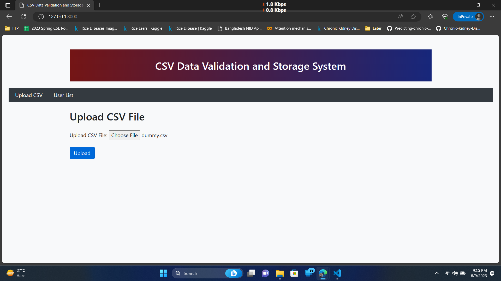

# CSV Data Validation and Storage System


The CSV Data Validation and Storage System is a web application developed using Django, a Python web framework. It provides a robust solution for validating and storing CSV (Comma-Separated Values) files containing user data. This README.md document serves as comprehensive documentation for the project, outlining its features, installation instructions, usage guide, and more.

## Table of Contents
- [Introduction](#introduction)
- [Installation](#installation)
- [Usage](#usage)
  - [Upload CSV File](#upload-csv-file)
  - [Summary Report](#summary-report)
  - [Duplicate Rows](#duplicate-rows)
  - [Invalid Rows](#invalid-rows)
  - [List Users](#list-users)
  - [Delete User](#delete-user)
- [Features](#features)
- [Screenshots](#screenshots)
- [Contributing](#contributing)
- [License](#license)

## Introduction
The CSV Data Validation and Storage System is designed to streamline the process of handling CSV files containing user data. It offers an intuitive web interface where users can upload their CSV files, which are then processed and validated by the system. The validated data is stored in a database for easy retrieval and management. The system also generates summary reports, identifies duplicate and invalid rows, and allows users to perform operations on the stored data.

The application is built using Django, a popular Python web framework known for its simplicity, scalability, and extensibility. It leverages Django's powerful features such as the Object-Relational Mapping (ORM) for database operations, form handling, and authentication to provide a secure and user-friendly experience.

## Installation
To run the CSV Data Validation and Storage System locally, follow these steps:

1. **Clone the repository** from GitHub by executing the following command in your terminal or command prompt:
   ```shell
   git clone https://github.com/your-username/csv-data-validation.git
   ```

2. **Change to the project directory**:
   ```shell
   cd csv-data-validation
   ```

3. **Create a virtual environment** (optional but recommended) to keep the project dependencies isolated:
   ```shell
   python3 -m venv env
   source env/bin/activate
   ```

4. **Install the required dependencies** by executing the following command:
   ```shell
   pip install -r requirements.txt
   ```

5. **Apply database migrations** to set up the required database schema:
   ```shell
   python manage.py migrate
   ```

6. **Start the development server** to run the application locally:
   ```shell
   python manage.py runserver
   ```

7. **Open your web browser** and navigate to `http://localhost:8000` to access the application.

Congratulations! You have successfully installed and configured the CSV Data Validation and Storage System on your local machine.

## Usage
The CSV Data Validation and Storage System provides several key features to help users manage CSV data effectively. Let's explore each of these features in detail:

### Upload CSV File
The "Upload CSV File" feature allows users to upload a CSV file containing user data. Upon visiting the designated page, users can select a file using the provided form and click the "Upload" button to initiate the process. The system then validates each row of data to ensure completeness, uniqueness, and data type conformity.

### Summary Report
After uploading a CSV file, the system generates a summary report that provides valuable insights into the uploaded data. The report includes

 the following information:

- Total Data: The total number of rows in the uploaded CSV file.
- Total Successfully Uploaded: The number of rows that passed the validation process and were successfully stored in the database.
- Total Duplicate: The number of rows that were identified as duplicates based on unique identifiers.
- Total Invalid: The number of rows that contained invalid or incomplete data.
- Total Incomplete: The number of rows that were missing required fields.

### Duplicate Rows
If the uploaded CSV file contains duplicate rows, the system identifies and lists them in a separate section of the summary report. The duplicate rows are displayed in a tabular format, showing the values of each field for easy identification and review.

### Invalid Rows
Similarly, if the uploaded CSV file contains rows with invalid or incomplete data, the system lists them in a dedicated section of the summary report. The invalid rows are displayed in a tabular format, alongside the reasons for their invalidity. This helps users identify and rectify any issues in the data.

### List Users
The "List Users" feature allows users to view and search the stored user data. Users can access this feature by clicking the "User List" link in the navigation menu. The page displays a table containing all the stored user records, including their names, email addresses, phone numbers, genders, and addresses.

The page also provides a search form that allows users to filter the displayed records based on various criteria such as name, email, phone number, gender, and address. Users can enter search values in the respective fields and click the "Filter" button to refine the list.

### Delete User
In addition to viewing the list of users, the system allows users to delete specific user records. Each user record in the list is accompanied by a "Delete" button. When clicked, this button triggers a confirmation prompt, and upon confirmation, the corresponding user record is deleted from the database.

## Features
The CSV Data Validation and Storage System offers the following key features:

1. **CSV File Upload**: Users can upload CSV files containing user data for processing and storage.
2. **Data Validation**: The system validates each row of data to ensure completeness, uniqueness, and data type conformity.
3. **Summary Report**: The system generates a summary report that provides an overview of the uploaded data, including statistics on successful uploads, duplicates, and invalid rows.
4. **Duplicate Row Detection**: The system identifies and reports duplicate rows based on unique identifiers.
5. **Invalid Row Detection**: The system identifies and reports rows with invalid or incomplete data.
6. **User List**: Users can view and search the stored user data, with options to filter the records based on various criteria.
7. **User Deletion**: Users can delete specific user records from the system.

These features collectively provide a comprehensive solution for managing CSV data, ensuring data integrity, and facilitating data retrieval and analysis.

## Screenshots
Here are some screenshots of the CSV Data Validation and Storage System in action:



*Screenshot: Uploading a CSV file containing user data.*


*Screenshot: Summary report showing statistics of the uploaded data.*


*Screenshot: List of duplicate rows identified in the uploaded CSV file.*


*Screenshot: List of invalid rows in the uploaded CSV file.*


*Screenshot: User list page displaying stored user data.*

## Contributing
Contributions to the CSV Data Validation and Storage System are welcome! If you have any suggestions, bug reports, or feature requests, please open an issue on the GitHub repository. If you'd like to contribute code, you can

 fork the repository, make your changes, and submit a pull request.

Please ensure that your contributions align with the project's coding style and follow the guidelines outlined in the repository.

## License
The CSV Data Validation and Storage System is open-source software released under the [MIT License](LICENSE). You are free to use, modify, and distribute the software as per the terms of the license.

Please note that while the CSV Data Validation and Storage System strives to ensure the accuracy and integrity of data, it is ultimately the user's responsibility to verify the results and take appropriate actions. The system is provided as-is, without any warranties or guarantees.